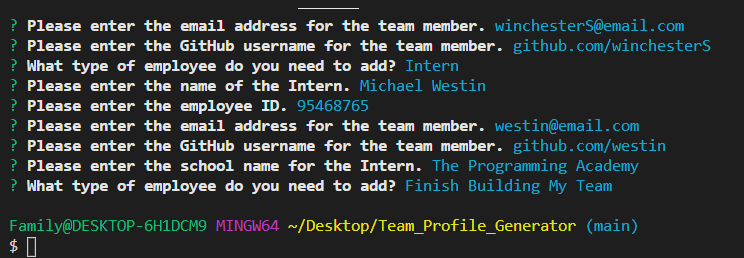
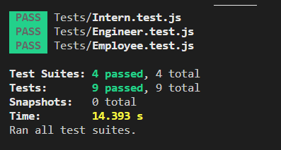

# Team Profile Generator

## Description
__________________________________________________________________________________________________________________________________________________
The Team Profile Generator allows the user to keep track of programming team members with simple node.js prompts that create an interactive html file to quickly and easily access email address and github profiles.

\
\

## Installation
__________________________________________________________________________________________________________________________________________________
In order to use the team profile generator: 
1. Use Git Bash or the VS terminal to run the following: 
   * Run 'npm i' to pull down the npm node package manager
   * Run 'npm init -y' to install package.json
   * Run 'npm install inquirer' to install the inquirer package that provides the needed prompt coding
   * Run 'npm install --save-dev jest' to install the jest testing package
2. Open the index.js file in Git Bash or the VS terminal
3. Run 'node index.js' to begin the team profile generator
4. To run any of the tests, open the 'Employee.test.js' file in Git Bash or the VS terminal
5. Run 'npm run test' to run the tests to see if they all pass.

## Usage
__________________________________________________________________________________________________________________________________________________
This program can be used with permission to generate a list of team members that includes their name, employee ID, email, and Github user profile address. For the team manager, you can also store a phone number and for an intern, their school.

\
<video width="320" height="240" controls>
    <source src="./Src/Team_Profile.mp4" type="video/mp4">
</video>

## License
__________________________________________________________________________________________________________________________________________________

## Contact
--------------------------------------------------------------------------------------------------------------------------------------------------
If you have any questions, please contact me at:\
✉️[Email](mailto:hrkoren@gmail.com)\
📂[GitHub](<https://github.com/hrkoren>)
